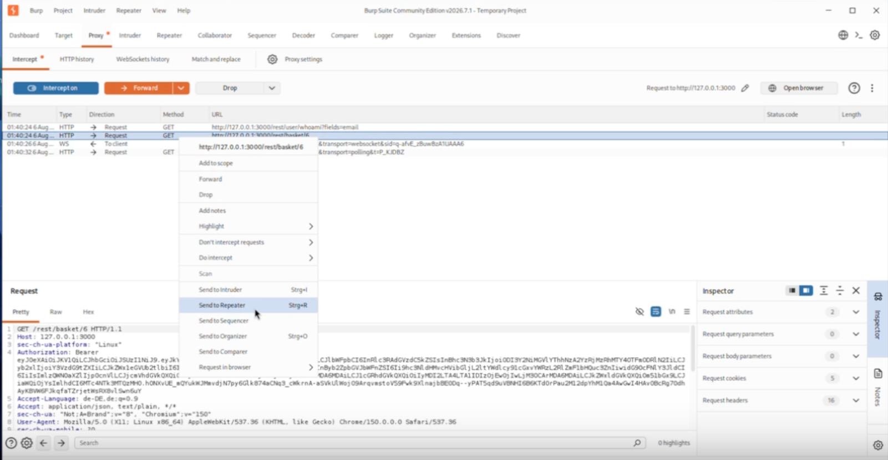
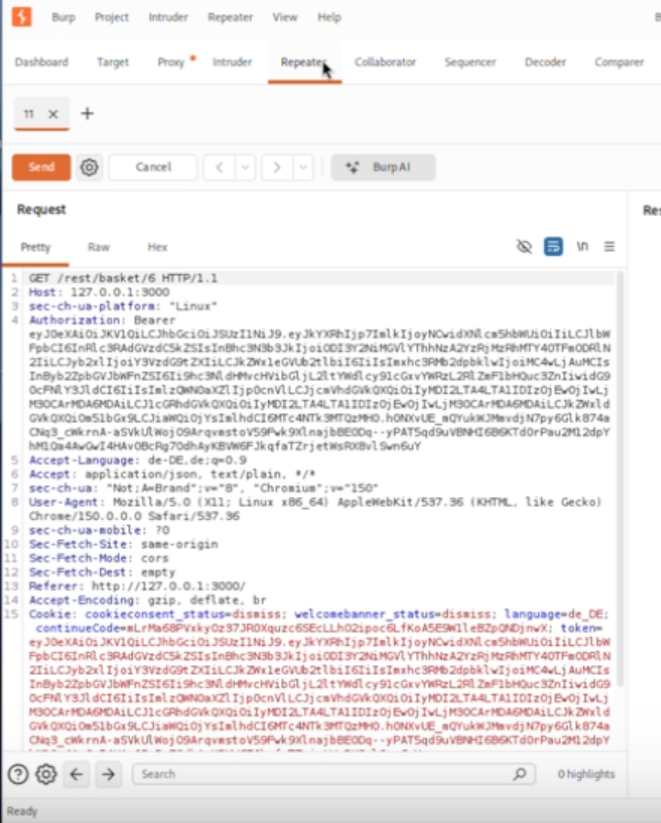
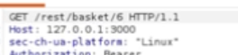
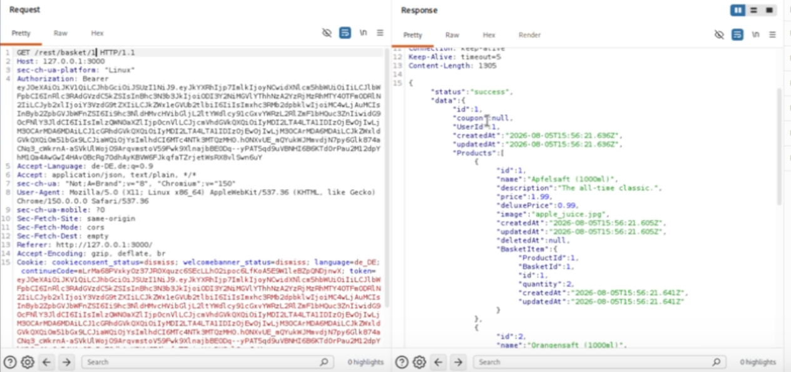

# View Another User's Basket

This challenge demonstrates a **Broken Access Control** vulnerability within the intentionally vulnerable OWASP Juice 
Shop application. It illustrates how missing server-side authorization checks can allow authenticated users to access 
resources belonging to other users. All demonstrations were performed on a local OWASP Juice Shop instance running inside
an isolated Kali Linux virtual machine for educational purposes only.

> [!WARNING]
> **Educational Disclaimer**
>
> This documentation is intended **for educational purposes only**.
> All demonstrations were performed on a local OWASP Juice Shop instance running on **localhost** inside an isolated virtual machine.
> The described techniques must never be used against systems without explicit authorization.

---

## Table of Contents

- [Goal](#goal)
- [OWASP Category](#owasp-category)
- [Environment](#environment)
- [Challenge Description](#challenge-description)
- [Methodology](#methodology)
- [Prerequisites](#prerequisites)
- [Step 1 – Open the Shopping Basket](#step-1--open-the-shopping-basket)
- [Step 2 – Intercept the Request](#step-2--intercept-the-request)
- [Step 3 – Analyze the Request](#step-3--analyze-the-request)
- [Step 4 – Modify the Basket Identifier](#step-4--modify-the-basket-identifier)
- [Step 5 – Verify the Result](#step-5--verify-the-result)
- [Proof of Concept](#proof-of-concept)
- [Security Impact](#security-impact)
- [Mitigation](#mitigation)
- [Conclusion](#conclusion)

---

## Goal

The objective of this challenge is to demonstrate a **Broken Access Control** vulnerability by accessing the shopping 
basket of another user. The exercise highlights the importance of proper server-side authorization and object ownership 
validation for user-specific resources.

---

## OWASP Category

**Broken Access Control**

Broken Access Control occurs when an application does not correctly enforce restrictions on authenticated users. As a 
result, users may gain unauthorized access to resources that belong to other users.

This challenge is an example of **Broken Object Level Authorization (BOLA)**, where access to objects is controlled only
by predictable identifiers instead of proper authorization checks.

---

## Environment

| Property | Value                        |
|----------|------------------------------|
| Operating System | Kali Linux Virtual Machine   |
| Application | OWASP Juice Shop             |
| Deployment | NPM                          |
| Network | localhost                    |
| Analysis Tool | Burp Suite Community Edition |
| Browser | Burp Browser                 |

---

## Challenge Description

The shopping basket functionality of OWASP Juice Shop exposes an authorization weakness.

Each shopping basket is identified by a numeric identifier. The application fails to properly verify whether the requested
basket belongs to the currently authenticated user before returning its contents.

Because of this missing ownership validation, it is possible to retrieve information from another user's shopping basket.

---

## Methodology

The challenge was analyzed using **Burp Suite Community Edition** together with the integrated **Burp Browser**.

While interacting with the shopping basket, the corresponding HTTP request was intercepted using Burp Suite. 
The intercepted request was then forwarded to **Burp Repeater** for further analysis.

Within Burp Repeater, the basket identifier contained in the request URL was modified to reference a different basket. 
After sending the modified request, the application returned the contents of another user's shopping basket in JSON format.

This behavior demonstrates that the backend relies on the provided basket identifier without performing sufficient 
server-side authorization checks.

The complete execution process is documented in the accompanying demonstration video.

---

## Prerequisites

Before starting the challenge, ensure that:

- OWASP Juice Shop is running.
- Burp Suite Community Edition is configured as the browser proxy.
- Burp Browser is used for all requests.
- A user account is logged in.

---

## Step 1 – Open the Shopping Basket

Open OWASP Juice Shop in the Burp Browser and log in with any valid user account.

After logging in, open the **Shopping Basket** page.

Enable **Intercept** in Burp Suite before opening the basket.

### Expected Result

Burp Suite should intercept the HTTP request responsible for retrieving the shopping basket.

> **Screenshot**
>

---

## Step 2 – Intercept the Request

Locate the intercepted basket request.

Forward the request to **Burp Repeater** for further analysis.

### Expected Result

The request is now available inside the Repeater tab where it can be modified without affecting the browser session.

> **Screenshot**
>
> 

---

## Step 3 – Analyze the Request

Inspect the request URL.

The basket endpoint contains a numeric basket identifier.

Example:

```text
GET /rest/basket/6
```

The numeric value identifies the requested shopping basket.

> **Screenshot**
>
> 

---

## Step 4 – Modify the Basket Identifier

Replace the basket identifier with another valid identifier.

Send the modified request using Burp Repeater.

### Expected Result

The server processes the modified request and returns the contents of the referenced basket.

> **Screenshot**
>
> 

---

## Step 5 – Verify the Result

Inspect the server response.

If the application returns basket information belonging to another user, the challenge has been successfully reproduced.

The response is returned as a JSON object containing the basket contents.

---

## Proof of Concept

After sending the modified request, the server responds with the contents of the requested shopping basket.

The response is returned as a JSON object containing product information, basket metadata and user-related data. Since the modified basket identifier belongs to another user, the application discloses information that should not be accessible to the currently authenticated user.

This confirms that the backend does not perform sufficient object-level authorization checks before returning protected resources.

### Expected Result

- The HTTP response status is **200 OK**.
- The response body contains basket data belonging to another user.
- The OWASP Juice Shop challenge is marked as completed.

---

## Security Impact

Broken Access Control vulnerabilities can have severe consequences for both users and organizations.

Possible impacts include:

- Unauthorized access to confidential user information
- Disclosure of personal or business-related data
- Privacy violations
- Unauthorized modification of resources
- Loss of customer trust
- Increased attack surface for further attacks

If similar vulnerabilities exist in production systems, attackers may be able to access sensitive information simply by 
manipulating object identifiers.

---

## Mitigation

The vulnerability can be prevented by implementing robust server-side authorization controls.

Recommended mitigation strategies include:

- Validate resource ownership on every request.
- Enforce object-level authorization before returning protected resources.
- Never rely solely on client-supplied identifiers.
- Apply the Principle of Least Privilege.
- Perform regular authorization testing during development.
- Conduct security reviews focusing on access control mechanisms.

---

## Conclusion

This challenge demonstrates that authentication alone is not sufficient to protect sensitive resources.

Applications must verify that every authenticated user is authorized to access the requested resource. 
Proper server-side authorization and ownership validation are essential to prevent unauthorized data exposure and 
remain one of the most important security requirements for modern web applications.
