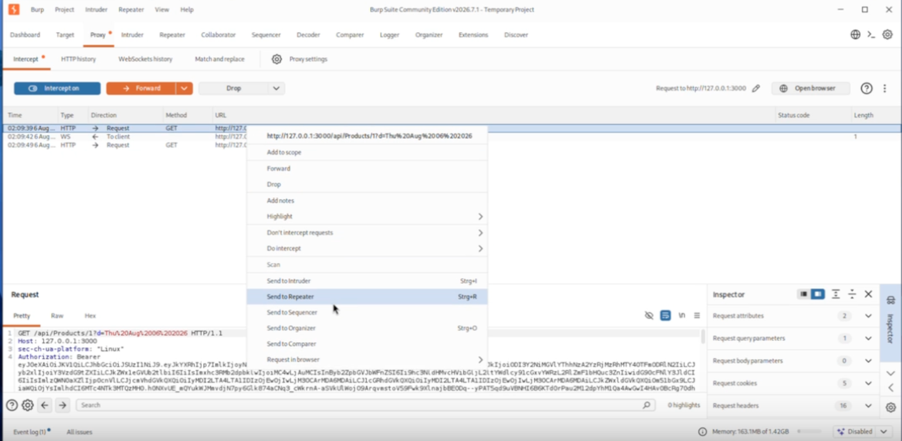
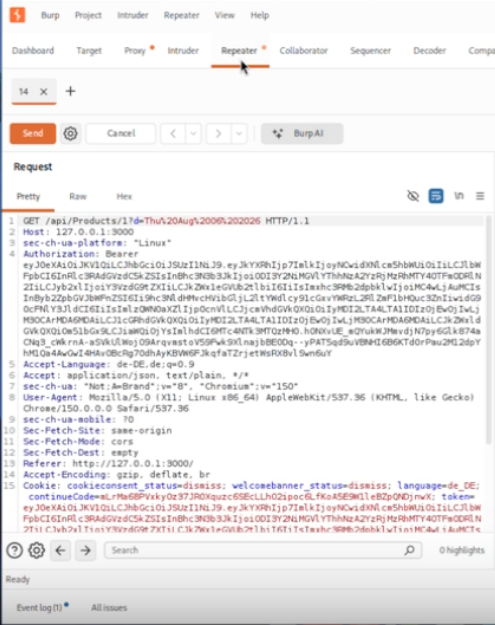
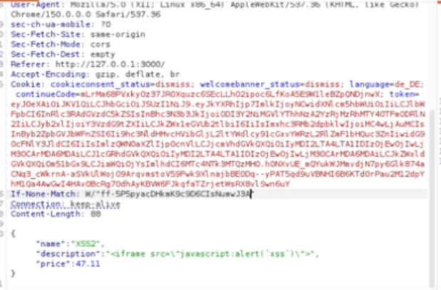
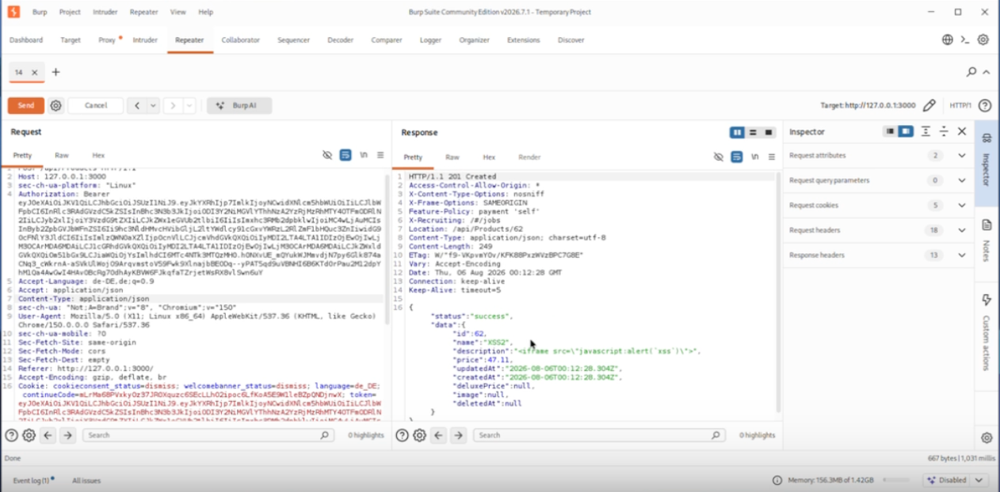
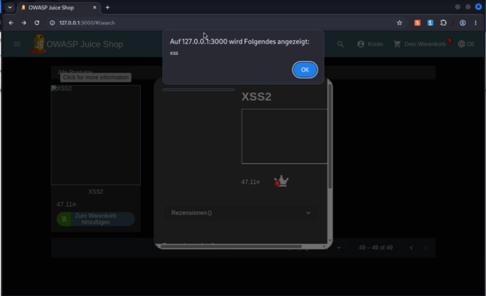

# API-only XSS

This challenge demonstrates a **Stored Cross-Site Scripting (XSS)** vulnerability exposed through the OWASP Juice Shop API. 
It illustrates how insufficient input validation and output encoding can allow malicious JavaScript code to be stored and
executed within the application. All demonstrations were performed on a local OWASP Juice Shop instance running inside an 
isolated Kali Linux virtual machine for educational purposes only.

> [!WARNING]
> **Educational Disclaimer**
>
> This documentation is intended **for educational purposes only**.
> All demonstrations were performed on a local OWASP Juice Shop instance running on **localhost** inside an isolated virtual machine.
> The described techniques must never be used against systems without explicit authorization.

---

## Table of Contents

- [Goal](#goal)
- [OWASP Category](#owasp-category)
- [Environment](#environment)
- [Challenge Description](#challenge-description)
- [Methodology](#methodology)
- [Prerequisites](#prerequisites)
- [Step 1 – Intercept the API Request](#step-1--intercept-the-api-request)
- [Step 2 – Send the Request to Burp Repeater](#step-2--send-the-request-to-burp-repeater)
- [Step 3 – Modify the Request](#step-3--modify-the-request)
- [Step 4 – Send the Modified Request](#step-4--send-the-modified-request)
- [Step 5 – Trigger the Stored XSS](#step-5--trigger-the-stored-xss)
- [Proof of Concept](#proof-of-concept)
- [Security Impact](#security-impact)
- [Mitigation](#mitigation)
- [Conclusion](#conclusion)

---

## Goal

The objective of this challenge is to demonstrate a **Stored Cross-Site Scripting (XSS)** vulnerability through the 
OWASP Juice Shop API. The challenge highlights the risks of accepting and storing unvalidated user input, which may later 
be executed in another user's browser.

---

## OWASP Category

**Cross-Site Scripting (XSS)**

Cross-Site Scripting (XSS) is a common injection vulnerability that allows attackers to inject malicious client-side 
scripts into trusted web applications. If user input is not properly validated and encoded before being rendered, 
the injected script may execute in another user's browser.

This challenge demonstrates a **Stored XSS** vulnerability because the malicious payload is stored by the application
and executed whenever the affected content is displayed.

---

## Environment

| Property | Value                        |
|----------|------------------------------|
| Operating System | Kali Linux Virtual Machine   |
| Application | OWASP Juice Shop             |
| Deployment | NPM                          |
| Network | localhost                    |
| Analysis Tool | Burp Suite Community Edition |
| Browser | Burp Browser                 |

---

## Challenge Description

This challenge demonstrates how the OWASP Juice Shop API accepts and stores user-supplied data without sufficient validation.

By manipulating API requests, it is possible to inject JavaScript code into application data. Since the application later 
renders this data without proper output encoding, the injected script is executed in the browser.

This behavior demonstrates a classic **Stored Cross-Site Scripting (Stored XSS)** vulnerability.

---

## Methodology

The challenge was analyzed using **Burp Suite Community Edition** together with the integrated **Burp Browser**.

Relevant API traffic was intercepted while interacting with the application. The intercepted request was forwarded to 
**Burp Repeater**, where the HTTP request could be examined and modified.

During the analysis, the request method and JSON request body were adjusted to demonstrate how user-controlled data is 
processed by the backend API. A harmless JavaScript payload was inserted into one of the submitted fields as a proof of concept.

After the modified request was processed by the application, the injected payload was stored and later executed when the 
affected content was displayed.

To ensure a safe demonstration, only a simple JavaScript alert dialog was used as the payload.

The complete execution process is documented in the accompanying demonstration video.

---

## Prerequisites

Before starting the challenge, ensure that:

- OWASP Juice Shop is running.
- Burp Suite Community Edition is configured as the browser proxy.
- Burp Browser is used.
- Intercept is enabled.

---

## Step 1 – Intercept the API Request

Open the vulnerable functionality inside OWASP Juice Shop.

Enable **Intercept** in Burp Suite and perform the action that creates the API request.

### Expected Result

Burp Suite intercepts the API request before it reaches the server.

> **Screenshot**

---

## Step 2 – Send the Request to Burp Repeater

Forward the intercepted request to **Burp Repeater**.

The request can now be modified without repeating the action inside the browser.

### Expected Result

The request is available inside the Repeater tab.

> **Screenshot**

---

## Step 3 – Modify the Request

Inspect the JSON request body.

Adjust the request so that the application accepts a new product description containing a harmless JavaScript payload.

For demonstration purposes, only a simple JavaScript alert dialog was used.

### Expected Result

The modified request now contains the XSS payload inside the JSON body.

> **Screenshot**

---

## Step 4 – Send the Modified Request

Send the modified request from Burp Repeater.

The application stores the supplied data.

### Expected Result

The server returns a successful HTTP response indicating that the request was processed successfully.

> **Screenshot**

---

## Step 5 – Trigger the Stored XSS

Navigate to the page displaying the manipulated content.

When the application renders the stored data, the injected JavaScript is executed.

### Expected Result

The browser displays the JavaScript alert dialog, confirming successful execution of the stored payload.

> **Screenshot**

---

## Proof of Concept

The challenge is successfully completed when the injected JavaScript is executed after the manipulated content is displayed.

The successful execution confirms that:

- User-controlled input was stored by the backend.
- The stored data was rendered without proper output encoding.
- Arbitrary JavaScript executed inside the browser.
- The OWASP Juice Shop challenge is marked as completed.

---

## Security Impact

Stored Cross-Site Scripting vulnerabilities can have severe consequences.

Possible impacts include:

- Execution of arbitrary JavaScript in another user's browser
- Theft of session cookies
- Session hijacking
- Account compromise
- Unauthorized actions performed on behalf of victims
- Credential theft
- Phishing attacks
- Defacement of web pages

Because the malicious payload is stored by the application, every user viewing the affected content may become a victim.

---

## Mitigation

Stored XSS vulnerabilities can be prevented through proper input handling and secure output rendering.

Recommended mitigation strategies include:

- Validate all user input on the server side.
- Apply context-aware output encoding before rendering user-controlled data.
- Sanitize HTML input where appropriate.
- Implement a strict Content Security Policy (CSP).
- Avoid rendering untrusted HTML or JavaScript.
- Perform regular security testing to identify injection vulnerabilities.

---

## Conclusion

This challenge demonstrates that accepting user input without proper validation and output encoding can introduce serious 
security vulnerabilities.

Stored Cross-Site Scripting remains one of the most dangerous client-side attacks because malicious code can affect every 
user who accesses the vulnerable content. Secure input validation, output encoding, and browser security mechanisms such 
as Content Security Policy are essential to preventing these attacks.