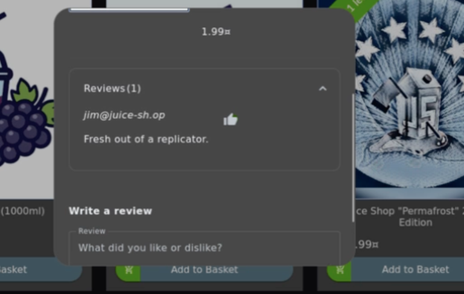
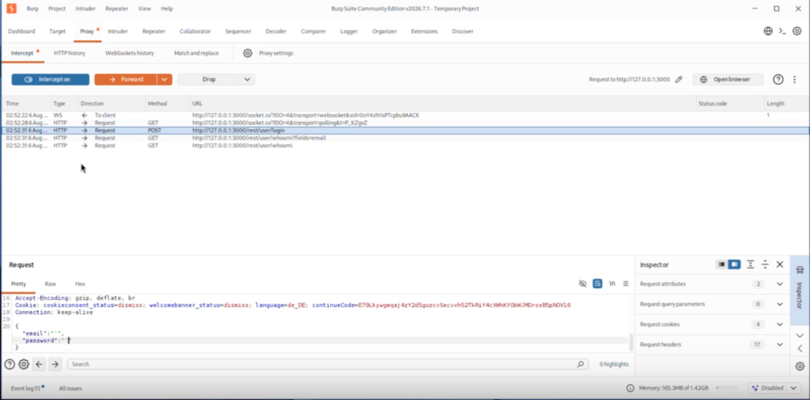
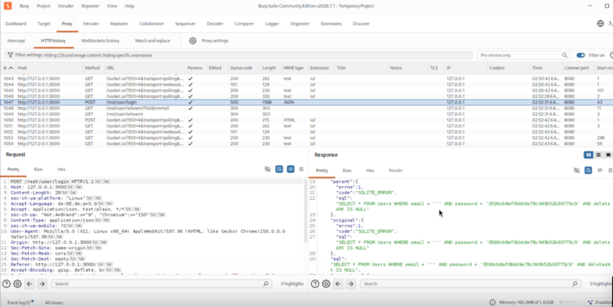
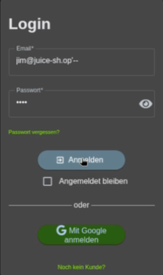
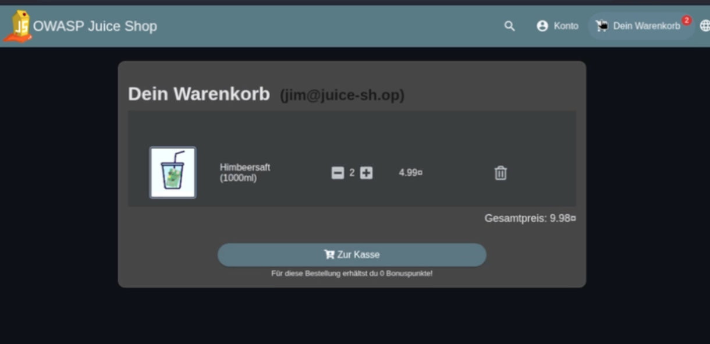

# Login as Jim

This challenge demonstrates a **SQL Injection** vulnerability within the intentionally vulnerable OWASP Juice Shop application.
It illustrates how insufficient input validation during the authentication process can allow attackers to bypass login
mechanisms and gain unauthorized access to user accounts. All demonstrations were performed on a local OWASP Juice Shop 
instance running inside an isolated Kali Linux virtual machine for educational purposes only.

> [!WARNING]
> **Educational Disclaimer**
>
> This documentation is intended **for educational purposes only**.
> All demonstrations were performed on a local OWASP Juice Shop instance running on **localhost** inside an isolated virtual machine.
> The described techniques must never be used against systems without explicit authorization.

---

## Table of Contents

- [Goal](#goal)
- [OWASP Category](#owasp-category)
- [Environment](#environment)
- [Challenge Description](#challenge-description)
- [Methodology](#methodology)
- [Prerequisites](#prerequisites)
- [Step 1 – Identify a Valid User](#step-1--identify-a-valid-user)
- [Step 2 – Analyze the Login Request](#step-2--analyze-the-login-request)
- [Step 3 – Test the Login Input](#step-3--test-the-login-input)
- [Step 4 – Bypass Authentication](#step-4--bypass-authentication)
- [Proof of Concept](#proof-of-concept)
- [Security Impact](#security-impact)
- [Mitigation](#mitigation)
- [Conclusion](#conclusion)

---

## Goal

The objective of this challenge is to demonstrate how a SQL Injection vulnerability can be used to bypass the application's 
authentication mechanism and gain unauthorized access to an existing user account.

---

## OWASP Category

**Injection**

SQL Injection is one of the most well-known injection vulnerabilities. It occurs when an application incorporates 
untrusted user input into SQL queries without proper validation or parameterization. As a result, attackers may manipulate
database queries to bypass authentication, retrieve sensitive information, or modify stored data.

---

## Environment

| Property | Value                        |
|----------|------------------------------|
| Operating System | Kali Linux Virtual Machine   |
| Application | OWASP Juice Shop             |
| Deployment | NPM                          |
| Network | localhost                    |
| Analysis Tool | Burp Suite Community Edition |
| Browser | Burp Browser                 |

---

## Challenge Description

This challenge demonstrates a vulnerable authentication mechanism within OWASP Juice Shop.

The login functionality does not sufficiently protect against SQL Injection attacks. By manipulating user-controlled input,
the authentication query can be altered, allowing an attacker to authenticate without providing the correct credentials.

The challenge highlights the importance of secure database interaction and proper input handling within authentication systems.

---

## Methodology

The challenge was analyzed using **Burp Suite Community Edition** together with the integrated **Burp Browser**.

The login request generated by the application was intercepted and inspected in order to better understand how the 
authentication process communicates with the backend. The intercepted request was forwarded to **Burp Repeater**, 
where the request structure could be analyzed in more detail.

During testing, the login form was supplied with crafted input designed to demonstrate the SQL Injection vulnerability 
implemented in the training application. The application's response confirmed that the authentication mechanism could be 
bypassed due to insufficient protection against SQL Injection.

The complete execution process is documented in the accompanying demonstration video.

---

## Prerequisites

Before starting the challenge, ensure that:

- OWASP Juice Shop is running.
- Burp Suite Community Edition is configured as the browser proxy.
- Burp Browser is used.
- Intercept is enabled.

---

## Step 1 – Identify a Valid User

Browse the application and locate a publicly visible user account.

Product reviews expose the reviewer's email address, which can be used as a valid login identifier.

### Expected Result

A valid user email address has been identified.

> **Screenshot**

---

## Step 2 – Analyze the Login Request

Attempt to log in while Burp Suite is intercepting the request.

Forward the request to **Burp Repeater** for further analysis.

### Expected Result

The complete HTTP login request is available for inspection inside Burp Repeater.

> **Screenshot**

---

## Step 3 – Test the Login Input

Inspect how the supplied username is incorporated into the authentication request.

The observed behavior indicates that user input is not properly sanitized before being processed by the backend SQL query, suggesting a potential SQL Injection vulnerability.

### Expected Result

The login request reveals that user-controlled input influences the backend query.

> **Screenshot**

---

## Step 4 – Bypass Authentication

Open the login page and enter the previously identified email address into the **Email** field.

Terminate the original SQL string by appending a single quotation mark (`'`) after the email address. Then use the SQL 
comment operator (`--`) to ignore the remaining part of the original query, including the password comparison.

The password field can contain any arbitrary value because the password verification is no longer evaluated by the database.

Submit the modified login request.

> **Screenshot**

### Expected Result

The application grants access to the selected user account without requiring the correct password.

> **Screenshot**

---

## Proof of Concept

The challenge is successfully completed when authentication is bypassed and the application logs in as the selected user without knowledge of the user's password.

The successful authentication confirms that:

- User input directly influences the backend SQL query.
- Authentication logic can be manipulated.
- Password verification is bypassed.
- The OWASP Juice Shop challenge is marked as completed.

---

## Security Impact

SQL Injection vulnerabilities can have severe consequences for web applications.

Possible impacts include:

- Authentication bypass
- Unauthorized account access
- Exposure of sensitive database information
- Modification or deletion of stored data
- Privilege escalation
- Complete compromise of the underlying database

Because authentication often protects critical functionality, SQL Injection vulnerabilities affecting login systems 
represent a significant security risk.

---

## Mitigation

SQL Injection vulnerabilities can be prevented by following secure database development practices.

Recommended mitigation strategies include:

- Use parameterized queries (prepared statements).
- Never concatenate user input into SQL queries.
- Validate and sanitize user input.
- Apply the Principle of Least Privilege for database accounts.
- Implement secure error handling to avoid leaking database information.
- Perform regular security testing for injection vulnerabilities.

---

## Conclusion

This challenge demonstrates how insecure handling of user input within authentication systems can result in a SQL 
Injection vulnerability.

Authentication is one of the most security-critical components of any web application. Implementing parameterized 
database queries, proper input validation, and secure coding practices is essential to protecting user accounts and 
preventing unauthorized access.
